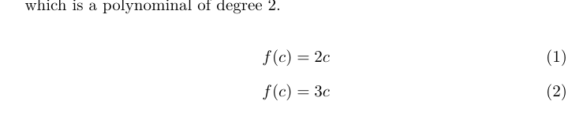

# La TeX 

- 安装textlive

- 安装teststudio

  ​    XeLatex编译器能处理中文

### 源文件结构分区

1. 分为**导言区**和**正文区**

- **导言区**：配置文档信息：如字体、标题、作者等
- **正文区**：为正文部分以`\begin`开始，`\end`结束

``` %导言区，book,report,正文区（文）正文区（文）
%导言区

\documentclass{article} %文档类：book,report，letter
\usepackage{ctex}
\title{my first document}
\author{Ren bo}
\date{\today}

%正文区（文稿区）

\begin{document}
	\maketitle
	你好, world! 
\end{document}
```

2. 文本包含两种模式：**文本模式**和**数学模式**(*以美元符号包裹：例`$f(x)$`

   - **数学模式 **：`$content$`表示**行内公式**，`$$content$$`表示**行间公式**（会自动居中，换行）

#### 示例代码

   ```
   %导言区
   
   \documentclass{article} % 文档类book,report,letter
   \usepackage{ctex}
   \title{my first document}
   \author{Ren bo}
   \date{\today}
   
   
   %正文区（文稿区）
   
   \begin{document}
   	\maketitle
   	你好, world! 
   	
   	Let $f(x)$be defined by the formula$$f(x)=2x+3x^2$$ which is a polynominal of degree 2.
   \end{document}
   ```

   ### 中文处理办法

默认编译器**XeLaTeX**,编辑器编码**UTF-8**,且在导言区用**`\usepackage{ctex}`**引入宏包。


### 字体属性

字体属性包含五种：

- 字体编码

  - 正文字体编码
  - 数学字体编码

- 字体系列

  中文字体：**`{\songti 宋体}\quad{\heiti 黑体}\quad{\fangsong 仿宋}\quad{\kaishu 楷书}`**

  - 粗细
  - 宽度

- 字体族

  `\textrm{roman family}   \textsf{sans serif family} \texttt{typewriter Family}`或者使用**声明形式**：`\rmfamily roman family \sffamily sans serif family \ttfamily typewriter Family`.注：**使用声明形式时可以用中括号{}来限定声明作用的范围**

  - 罗马字体 `\textrm{}` or `\rmfamily `
  - 无衬线字体
  - 打字机字体

- 字体形状

  - 直
  - 斜
  - 伪斜体
  - 小型大写

- 字体大小

  
### LaTeX文档结构

---

### Little Hints

1. LaTeX内代码换行不表示空格，代码空行（**多个连续空行与一空行效果相同**）表示分段，同`\par`。`\\`表示换行，不产生新的段落

2. LaTeX正文自动缩进

3. 使用楷书字体：`\author{\kaishu 任博}`;\heiti 黑体

4. 打开帮助文档：命令行使用`texdoc ctex查看ctex帮助文档；使用` texdoc lshort-zh `查看教程

5. equation类产生带编号公式：

   	```
   \begin{equation}
      	f(c)=2c
      	\end{equation}
      	
      	\begin{equation}
      	f(c)=3c
      	\end{equation}
   ```


6. `\quad`表示一个汉字的距离,`\quadd`表示两个汉字的距离。
7. **格式与内容分离思想**

