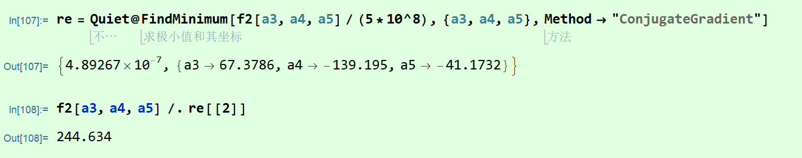

## MATHEMATICA LEARNING NOTES

### 2020.6.16

MeshFunction和MeshShading奇妙用法

配合来实现分区域着色：


----

### 2020.6.20

FindFit在处理一些任务时本质上是调用FIndMinimum：

````
data = Table[{x, N[10 E^Sin[x] + 2 x^2 + 0.1 (x + Cos[x])]}, {x, 1, 
   10}];
model[a_, b_][x_] := a E^Sin[x] + b x^2
residual[a_, b_] := Total[Table[(d[[2]] - model[a, b][d[[1]]])^2, {d, data}]] 
residual[1, 2] 
#2356.11
FindMinimum[residual[a, b], {a, 3}, {b, 3}]
#{0.218047, {a -> 10.0775, b -> 2.00994}}
#对比
FindFit[data, a E^Sin[x] + b x^2, {a, b}, x]
#{a -> 10.0775, b -> 2.00994}
````

---

### 2020.9.4 findminimum的玄学

需要缩放待优化函数的尺度到正常，并选取正确的方法。。。，非常玄学。。如图

