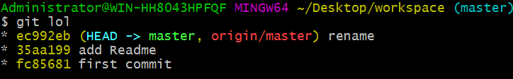
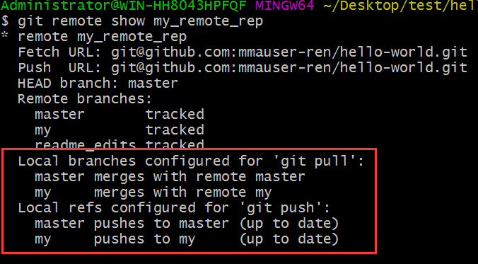

# git

### 工作区 暂存区  版本库  
git文件夹里面包含：

1. hooks
2. info
3. objects**存储**所有数据1内容，***版本库***
4. ref 分支有关
5. config （项目级别的配置，非 --global --system）
6. head  分支相关
7. description
8. index 暂存区信息

git add 先将工作目录东西到**版本库（objects里，用`git cat-file -p ` 部分文件名查看）** ，再由版本库到**暂存区（记录每个git对象）**，git对象是不断增加的，在最终提交时生成树对象，（树对象是覆盖的），再加上其他信息（注释，作者。。。）用提交对象包装。提交（**`git commit -m "注释"`**)不会清空暂存区，***最终提交是一个树对象，一个提交对象，多个git对象***

最终提交版本库（**objects**)里会多一个树对象（**包含文件的组织结构，文件名**）和提交对象（**包含姓邮箱注释信息**）

#### 文件状态

`git status`查看，克隆clone过来的都会被默认跟踪

1. 未跟踪  
2. 已跟踪
   - 已提交 *`git commit -m" or git commit -a -m""`*
   - 已修改 
   - 已暂存 *`add`*

#### 分支（branch） 

利用分支可以在文件各个版本之间穿梭,**本质上是指向提交对象的可变指针，也就是head文件**

`git branch name commitname` ** 创建一个分支**，并且使得分支指向对应的提交对象

`git merge banchname` **在master合并banchname分支

` git log --oneline --decorate --graph --all`查看所有分支历史**对应git lol**

` git config --replace-all alias.lol "log --oneline --graph --all"`如此配置快捷键

#### 后悔药

- 工作区

    红色 modified  。撤回工作目录的修改 ：`git restore filename`

- 暂存区

    add命令添加到暂存区（**`git ls-files -s`**查看暂存区文件）撤回暂存：`git restore --staged filename`，撤回后变成**红色 modified**状态

- 版本库

    撤回提交： 可以重新提交，提交的是**暂存区的内容**，提交后暂存区没消失，可以用`git add` 更新暂存区内容，再用** `git commit --amend` **覆盖提交暂存区内容。
           

#### tag标签

  为任何一次提交打上标签

  - `git tag `列出所有标签
    - `git tag name`为当前commit打上标签
    - `git tag name commihash`为某一次commit打上标签
    - `git tag -d name` 删除标签

  

#### 命令

`git checkout -b branchname ` 创建分支并进入

 `git stash` 储存当前，以栈的形式

 `git stash list`

 `git stash drop stash@{}`

 `git stash apply`

 `git stash pop`

#### 远程

- 创建github**空仓库**

- git设置别名**origin**，`$ git remote add origin 别名 git@github.com:mmauser-ren/local-upload.git仓库地址`

- 绑定SSH

- `git push -u origin master`,推**别名、分支**（生成**远程跟踪分支**），用push向远端推代码时，会生成一个当前分支对应的远程跟踪分支**（branchname->别名/branchname例：master->别名/master）**，~~并在远程的仓库创建此分支~~(**更正：在远端仓库创建分支用`git push 别名  branchname`**)。需要注意的是

- `git remote fetch  项目名origin` 从远端获取没有的数据，（**读的权限有，因为项目是public**），且数据是拿到远程跟踪分支上的（~~**非本地**~~)

   注：有**三个分支**，：**本地mater 分支**、**origin/master（远程跟踪分支）**、**远程master分支**，
   
     
   
   
   
   - `git remote -v`查看远端仓库信息
   
   - `git push 别名  branchname` **向远程仓库新建分支，或者推送分支信息**
   
   - `git remote show 别名`查看一个远程仓库的信息，（显示远程仓库的分支信息、是否被跟踪······）**==且能显示远程跟踪分支和对应本地分支是否关联：只有关联的才能直接 git push 、git pull，如下图红框内的是关联过的）==**
   
     
   
     **关联方法1**
   
     ​     1 . `git branch --set-upstream-to=别名/本地分支名`
   
     ​     2 . **==`git branch -u 别名/本地分支名`,和`git branch --set-upstream-to=别名/本地分支名`一样效果==**,差别详细见**[stackoverflow-answer]( https://stackoverflow.com/questions/5697750/what-exactly-does-the-u-do-git-push-u-origin-master-vs-git-push-origin-ma )**，
   
   - `git remote rename oldname newname`远程仓库重命名
   
   - `git remote remove name`删除别名为name的远程仓库、
   
   - ` git branch -a` **查看所有分支：本地和跟踪分支**
   
   - `git clone远程仓库`自动获取一个远程仓库深度的内容（**包括所有分支的内容，b并且为这些分支创建对应的远程跟踪分支origin/branchname,但是只会创建一个本地分支master，**），并取别名为origin，，

## 快捷

1. st  status
2. ca commit -a -m
3. c commit -m

