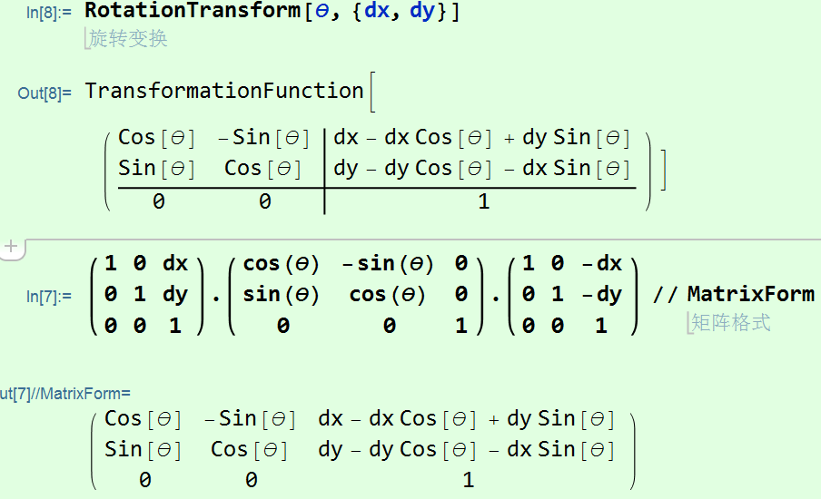
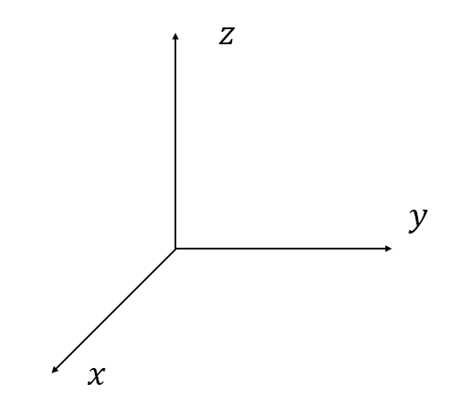
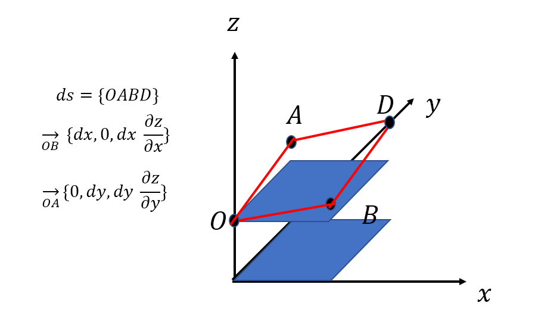
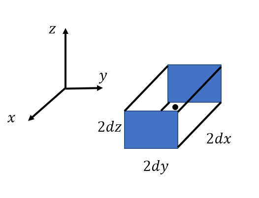
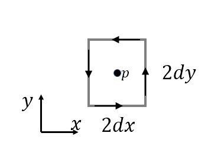

# Learning

## 旋转矩阵

对图像的变换有很多种，旋转、剪切、平移等等，这些变换都与矩阵、线性代数有着密不可分的联系**（对矩阵以及线性代数的理解可参考3blue1brown视频）**。

### 二维

二维的旋转主要包括绕原点和绕任意点的旋转，后者更具有普遍性。

#### 绕原点旋转

绕原点旋转的情况十分简单，可以直接由一个二维矩阵来描述其旋转效应：
$$
\begin{pmatrix}
	\cos \theta & -\sin \theta\\
	\sin \theta &  \cos \theta
\end{pmatrix}
$$
表示绕原点逆时针旋转$\theta$角度。

#### 绕任意点旋转

绕任意点旋转可以看成三个步骤：

1. 将旋转点做平移变换**T(-x,-y)**(变换到原点
2. 在原点进行旋转变换**R**
3. 再做平移变换**T(x,y)**移回旋转点到原位置

整个旋转可以表示为：$ T(x,y) R T(-x,-y) $

##### 平移变换

   平移变换不同于旋转和剪切，需要引入一个新维度，下式为二维的平移矩阵，效果为$（dx,dy）$平移：
$$
\begin{pmatrix}
	1 & 0 & dx \\
	0 & 1 & dy \\
	0 & 0 & 1
\end{pmatrix}
$$
综上，我们可以写出绕二维平面任意点旋转的变换:
$$
M=
\begin{pmatrix}
	1 & 0 & dx \\
	0 & 1 & dy \\
	0 & 0 & 1
\end{pmatrix} \cdot 
\begin{pmatrix}
	\cos \theta & -\sin \theta & 0 \\
	\sin \theta &  \cos \theta & 0 \\
	0 & 0 & 1
\end{pmatrix} \cdot
\begin{pmatrix}
	1 & 0 & -dx \\
	0 & 1 & -dy \\
	0 & 0 & 1
\end{pmatrix}
$$
可见为了保证齐次性，我们在旋转矩阵也引入了一个新维度。

使用mma代码验证：

```
RotationTransform[\[Theta], {dx, dy}](*内置函数*)

{{1, 0, dx}, {0, 1, dy}, {0, 0, 1}}.{{Cos[\[Theta]], -Sin[\[Theta]], 
    0}, {Sin[\[Theta]], Cos[\[Theta]], 0}, {0, 0, 1}}.{{1, 
    0, -dx}, {0, 1, -dy}, {0, 0, 1}} // MatrixForm(*手动变换*)

```



### 三维

三维旋转主要是绕某一轴旋转，简单情况是绕坐标轴旋转，普遍情况是绕任意轴旋转。

#### 绕坐标轴旋转

绕坐标轴旋转只需要注意**旋转角度正方向的约定（右手螺旋）**：

                                                                                                                                                                                                                                                                                                                                                                                                                                                                                                    

可以写出绕三个轴分别的旋转矩阵，考虑到平移变换，我们需要增加一个维度：
$$
\begin{pmatrix}x^`  \\y^`  \\z^`  \\1  \end{pmatrix}
=
\begin{pmatrix}
	\begin{array}{c c c c|c c c c|c c c c}
	1 & 0 & 0 & 0 & \cos \theta & 0 & \sin \theta & 0 & \cos \theta & - \sin \theta & 0 & 0\\
	0 & \cos \theta & - \sin \theta & 0 & 0 & 1 & 0 & 0 & \sin \theta & \cos \theta & 0 & 0\\
	0 & \sin \theta & \cos \theta & 0 & - \sin \theta &0 & \cos \theta & 0 & 0 & 0 & 1 & 0 \\
	0 & 0 & 0 & 1 &    0 & 0 & 0 & 1 &   0 & 0 & 0 & 1 \\
	\end{array}
\end{pmatrix}
\cdot
\begin{pmatrix}  x\\ y \\z \\1  \end{pmatrix}
$$
以上分别是绕**x、y、z**坐标轴旋转的旋转矩阵。

####　绕过原点任意轴旋转	 

对于绕过原点任意轴旋转，我们也可以将其整个过程分解：主要思想是通过两次变换将旋转轴依次变换到坐标平面、坐标轴上，此时相对坐标轴的旋转变换容易求得，此后在反方向依次变换回去 。                                                                                                                                                                                                                                                                                                                                                                                                                                                                                                                                                                                                                                                                                                                                                                                                                                                                                                                                                                                                                                                                                                                                                                                                                                                                                                                                                                                                                                                                                                                                                                                                                                                                                                                                                                                                                                                                                                                                                                                                                                                  

```                                                                                                                                                                                                                                                                                                                                                                                                                                                                                                                                                                                                                                                                                                                                                                                                                                                                                                                                                                                                                                                                                                                                         
(*可以看到两种方法的结果一样*)
(*内置方法*)
RotationMatrix[1., {1, 2, 3}] // N // MatrixForm

（*按照分解重构方法*）
{a, b, c} = {1, 2, 3}
RotationMatrix[-ArcCos[c/Sqrt[b^2 + c^2]], {1, 0, 0}].
RotationMatrix[ArcSin[a/Sqrt[a^2 + b^2 + c^2]], {0, 1, 0}].
RotationMatrix[1, {0, 0, 1}].
RotationMatrix[-ArcSin[a/Sqrt[a^2 + b^2 + c^2]], {0,1, 0}].
RotationMatrix[ArcCos[c/Sqrt[b^2 + c^2]], {1, 0, 0}] 
// N // MatrixForm
```

#### 绕任意旋转轴旋转

主要分两种情况：平行坐标轴和非平行（后者2包含前者）

##### 平行坐标轴

平行坐标轴仅需要先做平移变换，在做相对坐标轴的旋转变换，在做平移变换回去。

#####　任意坐标轴

先平移到原点，再根据绕原点任意坐标轴旋转进行操作，最后在逆平移变换。

```
%以下变换是基于点｛0,0,1｝处{1, 1, 1}方向轴的旋转变换
%内置函数
RotationTransform[1., {1, 1, 1}, {0, 0, 1}]
%{1.30647, 1.36094, 3.33259}

%做平移分解，再根据绕原点任意坐标轴旋转（根据平移操作特性增加维度）
{{1, 0, 0, 0}, {0, 1, 0, 0}, {0, 0, 1, 1}, {0, 0, 0, 1}}.
((RotationMatrix[1., {1, 1, 1}]~Join~{{0, 0, 0}}) // Transpose[Join[Transpose[#], {{0, 0, 0, 1}}]]&).
{{1, 0, 0, 0}, {0,1, 0, 0}, {0, 0, 1, -1}, {0, 0, 0, 1}}.{1, 2, 3, 1}
%{1.30647, 1.36094, 3.33259, 1.}
```

---

> 参考文献为：[博客园-旋转矩阵]( https://www.cnblogs.com/WangGuiHandsome/p/10094784.html)
>
>  自制动图源文件在桌面，动图展示太大。。。。

+++

+++

## 散度、旋度、斯托克斯公式、高斯公式、曲线曲面积分

曲线积分第一型可以看作是求线质量，第二型可以看成求变力做功；曲面积分第一型可以看成求面质量，第二型可以看成求矢量场在曲面上的通量；矢量场中某点的散度是描述矢量场在这一点处（极小领域）的**发散**或者**汇聚**情况，与通量存在联系；高斯公式就是将闭合曲面上的通量和闭合曲面围成区域内的散度联系在一起，也就是将第二型曲面积分和三重积分联系在一起；矢量场中某点的旋度是描述矢量场在这一点处（极小领域）的旋转情况（旋转轴、旋转方向：右手螺旋.....)；斯托克斯公式就是将第二类曲线积分和曲线围成曲面内的旋度联系起来,二维的斯托克斯公式为格林公式

### 曲线积分

#### 第一类

对应实际物理问题：已知曲线质量线密度为$ f(x,y)$,求曲线$C(A,B)$(A、B为曲线端点的质量：
$$
\int_{C(A,B)}f(x,y)dl
$$
其中ds为曲线微元：
$$
dl=\sqrt{dx^2+dy^2}
$$
当曲线方程为参数方程即：
$$
\left
\{
\begin{aligned}
x=\phi(t)\\
y=\psi(t)
\end{aligned}
\right.
$$
易知ds可化为：
$$
dl=\sqrt{{\phi'}^2(t)+{\psi'}^2(t)}dt
$$
当曲线方程为$y=y(x)$易知ds为：
$$
dl=\sqrt{\frac {dx^2}{dx^2}{dx^2}+\frac {dy^2}{dx^2}{dx^2}}=\sqrt{1+{y'}^2}dx
$$
其余情况同样根据ds定义推导

#### 第二类

对应实际问题：力场$\vec f(x,y)$在曲线$C(A,B)$上的做功，也就是变力做功问题：
$$
\int_{C(A,B)}\vec f\cdot d\vec l
$$
力场为矢量场具有方向性，同样ds也具有方向性：
$$
\vec f(x,y)=P(x,y) \vec i+Q(x,y) \vec j=(P,Q)
$$
矢量场中某一点$p(x,y,z)$的散度用来描述矢量场的**汇聚**和**发散**。

$d \vec l$:
$$
d \vec l=(\cos \alpha,\cos \beta)dl
$$
又知：
$$
\left \{
\begin{aligned}
\cos \alpha = \frac {dx} {\sqrt{dx^2+dy^2}} \\
\cos \beta  = \frac {dy} {\sqrt{dx^2+dy^2}}
\end{aligned}
\right.
$$
结合式（6）需知 ,==方向角为路径曲线的方向角==：
$$
\left \{
\begin{aligned}
\cos \alpha = \frac {dx} {dl} \\
\cos \beta  = \frac {dy} {dl}
\end{aligned}
\right.
$$
所以积分方程可化为：
$$
\begin{align}
\int_{C(A,B)}\vec f\cdot d\vec l &=\int_{C(A,B)}(P,Q) \cdot (\cos \alpha,\cos \beta)dl \\
&= \int_{C(A,B)}(P\cos \alpha+Q\cos \beta)dl \\
&= \int_{C(A,B)}Pdx+Qdy
\end{align}
$$
式（13）对应于一二型曲面积分之间的联系。

三维和二维类似。

### 曲面积分

#### 第一类

对应物理问题:已知曲面质量面密度为$ f(x,y,z)$,求曲面$\sum$的质量：
$$
\int\int_\sum f(x,y,z)ds
$$
曲面$\sum$为$z=z(x,y)$时，空间面积微元ds如下：


$$
\begin{align}
ds &= \left| \vec OB \times \vec OA \right| \\
&=\left| (dx,0,{z'}_x dx) \times (0,dy,{z'}_y dy) \right |\\
&=\sqrt{1+{z'}_x^2+{z'}_y^2} dx dy

\end{align}
$$
曲面$\sum$为$x=x(z,y)$和$y=y(z,x)$情况类似推导就行。此时第一类曲面积分就化为二重积分

#### 第二类

实际问题：矢量场$\vec f(x,y,z)$在曲面$\vec \sum$上的通量：
$$
\int\int_\sum \vec f(x,y,z)d \vec s
$$
矢量场为：
$$
\vec f(x,y,z) =(P(x,y,z),Q(x,y,z),R(x,y,z))
$$
面积微元$d \vec s$大小等于式（16），方向为法线方向：
$$
d\vec s=(\cos \alpha,\cos \beta ,\cos \gamma)ds
$$
根据面积微元在三个坐标轴平面的投影可知：
$$
\left\{
\begin{aligned}
\frac{dxdy}{ds} = \pm \cos \gamma \\
\frac{dydz}{ds} = \pm \cos \alpha \\
\frac{dzdx}{ds} = \pm \cos \beta
\end{aligned}
\right.
$$
带入可知：
$$
\begin{align}
\int\int_\sum \vec f(x,y,z)d \vec s &= \int\int_\sum(P,Q,R) \cdot (\cos \alpha,\cos \beta ,\cos \gamma)ds \\
&= \int\int_\sum(P \cos \alpha+Q \cos \beta +R \cos \gamma)ds \\
&= \pm \int\int_{a_{yz}}Pdydz \quad \pm \int\int_{a_{zx}}Qdzdx\quad \pm \int\int_{a_{xy}}Rdxdy
\end{align}
$$
将第二型曲面积分化为了三个二重积分的和，注意考虑曲面的方向问题。**（值得注意的是为什么可以分开成三个二重积分。第二类曲线积分不能分为两个一维积分容易理解，因为这对应于做功与路径相关）**

### 散度和gauss公式

散度计算公式：
$$
\begin{align}
div(\vec f) & = \nabla \cdot \vec f(x,y,z) \\
&=(\frac{\partial}{\partial x},\frac{\partial}{\partial y},\frac{\partial}{\partial z}) \cdot (P(x,y,z),Q(x,y,z),R(x,y,z)) \\
&= \frac{\partial P}{\partial x}+\frac{\partial Q}{\partial y}+\frac{\partial R}{\partial z}\\
\end{align}
$$
散度的定义为：
$$
\lim_{V->p} \frac {\int \int_s \vec f \cdot d \vec s }{V}
$$
可以形象的理解为**通量体密度**，s为闭合的曲面，v是s曲面包围着的区域。散度是一个数值，矢量场中某点的散度表示这点附近极小体积区域表面的**外法向曲面通量和**再除以区域体积，由曲面积分表示通量可知散度为正代表区域内有**”源“**，即小体积区域处矢量场向外发散（包括流出大于流入等实际情况），散度为0表示整个闭合曲面通量为零（**流入等于流出，无源，一般不可压缩流体的散度都为零**）,散度为负自行想象。。。

散度计算公式的推导：



如图右边长方体为一点处领域，求矢量场$\vec f(x,y,z)=(P,Q,R)$中这个长方体的**外法向通量**可以分为3部分，首先求x方向两个面的通量和为：
$$
\begin{align}
((P(x+dx,y,z)-p(x-dx,y,z))2dz2dy & =\frac {(P(x+dx,y,z)-p(x-dx,y,z)}{2dx}2dx 2dz2dy\\
&=\frac{\partial P}{\partial x}8dxdydz
\end{align}
$$
其中$8dxdydz$为区域体积，这样再求出y、z方向通量，加和除以体积就得到散度的计算公式（27），因此命名为通量体密度。

----

gauss公式是**使用切割思想，将闭合曲面围成的区域分割成一个一个小长方体，在整个曲面外法向上的通量等于切割后所有区域的通量和，因为每个长方体的公共面上的通量会被相互抵消，最后只剩最外的曲面**，即：
$$
\begin{align}
\int \int_{s^+} \vec f \cdot d\vec s &= \int \int \int _\Omega \nabla \cdot\vec f dV\\

\end{align}
$$
---

### 旋度与stokes公式

旋度计算公式：
$$
\begin{align}
curl(\vec f) &= \nabla \times \vec f \\
&= \begin{vmatrix}
\vec i & \vec j & \vec k \\
\frac \partial {\partial x} & \frac \partial {\partial y} &\frac \partial {\partial y}\\
P & Q & R
\end{vmatrix}\\
&=
(\frac{\partial R}{\partial y}-\frac{\partial Q}{\partial z}) \vec i +
(\frac{\partial P}{\partial z}-\frac{\partial R}{\partial x}) \vec j +
(\frac{\partial Q}{\partial x}-\frac{\partial P}{\partial y}) \vec k
\end{align}
$$
旋度的定义：
$$
\lim_{S->p} \frac { \int_C \vec f \cdot d \vec l }{S}
$$
旋度可以看成环量（环流量）面密度，由旋度的定义可知旋度是个矢量，矢量场中某点的旋度矢量包含这点的相对旋转轴，以及旋转方向，以及”转速“信息。

旋度计算公式推导：



如图所示，求场$\vec f(x,y)=(P,Q)$在p点处的**环流量（第二型曲线积分）**，分为上下、左右两部分求，首先上下：
$$
\begin{align}
&=\frac{P(x_0-dx,y_0-dy)+P(x_0+dx,y_0-dy)}{2} 2dx-
\frac{P(x_0-dx,y_0+dy)+P(x_0+dx,y_0+dy)}{2} 2dx \\
&=-\frac{\partial P(x_0-dx,y_0)}{\partial y}2dxdy-\frac{\partial P(x_0+dx,y_0)}{\partial y}2dxdy
\end{align}
$$
考虑$dx\rightarrow 0$得:
$$
-\frac{\partial P(x_0,y_0)}{\partial y}4dxdy
$$
同理求得左右的环流量为：
$$
\frac{\partial P(x_0,y_0)}{\partial x}4dxdy
$$
加和得$p(x_0,y_0)$小邻域处环流量为：
$$
(\frac{\partial P(x_0,y_0)}{\partial x}-\frac{\partial P(x_0,y_0)}{\partial y})4dxdy
$$
其中$4dxdy$为区域面积，除以面积就是环量面密度，也就是旋度（二维情况）。三维旋度可以看成在三个坐标平面分别计算，方向为右手螺旋法则。

我们已知旋度的意义有矢量场的旋转趋势：可知第二型曲线积分对应变力做功物理问题，我们设定了闭合曲线的正方向为逆时针，对于力场中某点的旋度值为正，我们可以理解为力做正功，即可以理解为力场的方向与曲线正方向相同（近似，考虑力场做功的整体效应）。

---

stokes公式

==注：公式使用时需要区域内不含奇点，例如分母为$x^2+y^2$就不行，这种情况需要借助挖洞法..==

在计算空间闭合曲线的第二型曲面积分（环流量）时，我们同样可以采取分割的思想，将闭合曲线围成的平面分成一个一个小区域，因为相邻区域公共边的环流量刚好抵消，我们只需要计算闭合曲线围成平面内旋度的第二型曲面积分:
$$
\int_C \vec f \cdot d \vec l=\int \int (\nabla \times \vec f) \cdot d \vec s
$$

---

---

关于旋度散度主要参考：

1. 可汗学院的讲解，b站有视频
2. 知乎：[深度理解数学：旋度、散度、高斯...]( https://zhuanlan.zhihu.com/p/71503766 )

----

## diracdelta函数积分问题

容易知道$\delta$函数积分有筛选性质：
$$
\int_{-\infty}^\infty \delta(x)f(x) dx=f(0)
$$
diracdelta函数的性质(与泰勒一阶展开有关）：
$$
\delta(\phi (x)) = \sum_k \frac{\delta (x-x_k)}{|(\phi'(x_k)|}
$$
纠正误区：认为三维delta函数积分结果为f(x)==0的曲面面积，比如认为以下积分结果为球面面积$4\pi$，
$$
\int\int\int_{-\infty}^\infty \delta(x^2+y^2+z^2-1)dx
$$
但实际结果：

````
Integrate[
 DiracDelta[x^2 + y^2 + z^2 - 1], {x, -Infinity, 
  Infinity}, {y, -Infinity, Infinity}, {z, -Infinity, Infinity}]
 %2Pi
````

说明两者之间不是这种对应关系。。。。
$$
\int_{-\infty}^\infty \delta(x^2+y^2+z^2-1)dx
$$
q